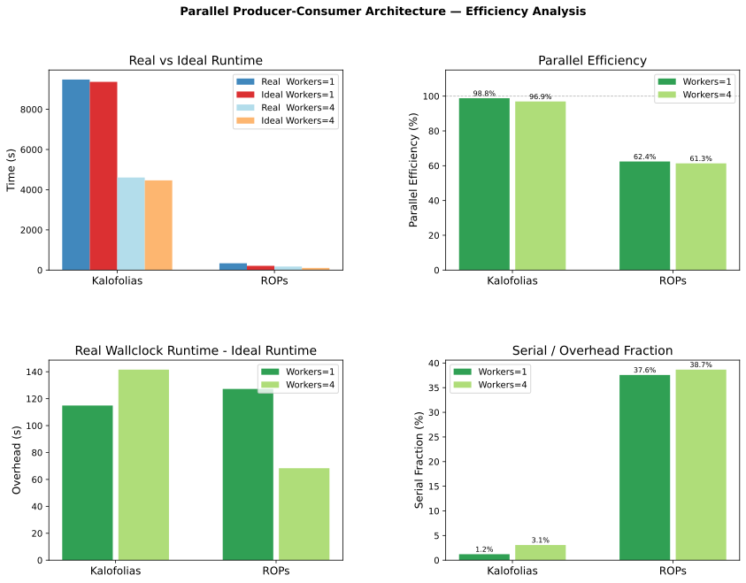

# Block-based Spectral Image Reconstruction - Parallel Processing Efficiency Analysis 

## Overview

The block-based spectral image reconstruction algorithm is supported by a *producer-consumer parallel architecture*. To evaluate it, we compare actual **wall-clock runtime** against the **total accumulated compute time** across all processors. The ratio of total compute time to the number of workers defines an **ideal runtime** — the expected duration under perfect parallelism with no coordination overhead. 

The ratio of real runtime to ideal runtime yields **parallel efficiency**, and its complement captures the fraction of time lost to serialization, queue contention, or other synchronization costs.

---

## Results

<figure>
  
  <figcaption style="text-align:center; font-size:0.9em; color:#555;">
    Figure 1. Real vs ideal runtime, parallel efficiency, absolute overhead, and serial fraction
    for ROPs and Kalofolias graph types across worker pool sizes.
  </figcaption>
</figure>

---

## Interpretation

### Kalofolias — Near-Ideal Scaling
Kalofolias achieves **≥97% parallel efficiency** at both worker counts, with overhead remaining roughly constant (~115–142 s) regardless of pool size. This indicates the architecture introduces a fixed, small coordination cost that is negligible relative to the compute-heavy nature of Kalofolias tasks.

### ROPs — Efficiency Bounded by Task Granularity
ROPs efficiency plateaus at **~61–62%** across both worker counts, with a serial fraction of ~38%. Critically, this fraction does not decrease as workers increase — the Karp-Flatt signature of overhead that scales with load rather than a fixed serial code path. Given that IPC is lightweight (file paths + lazy pickles), the most likely cause is **producer starvation**: ROPs tasks are consumed faster than the producer can dispatch them, leaving workers idle.

### Quality is Unaffected
Reconstruction quality (SAM, PSNR, SSIM) is identical across worker counts for both graph types, confirming that parallelization introduces no numerical artifacts.

---

## Summary Table

| Graph       | Workers | Parallel Efficiency | Serial Fraction | PSNR  | SSIM |
|-------------|---------|--------------------:|----------------:|-------|------|
| ROPs        | 1       | 62.4%               | 37.6%           | 44 dB | 0.91 |
| ROPs        | 4       | 61.3%               | 38.7%           | 44 dB | 0.91 |
| Kalofolias  | 1       | 98.8%               | 1.2%            | 44 dB | 0.92 |
| Kalofolias  | 4       | 96.9%               | 3.1%            | 44 dB | 0.92 |

---

## Conclusion

The architecture scales efficiently for compute-heavy tasks (Kalofolias). For fine-grained tasks (ROPs), a ~38% overhead floor is present and stable — a characteristic of task granularity relative to dispatch cost rather than a scalability defect. Speedups are clearly demonstrated in both cases; further optimization (e.g. task batching for ROPs) would be an engineering concern beyond the scope of this evaluation.
